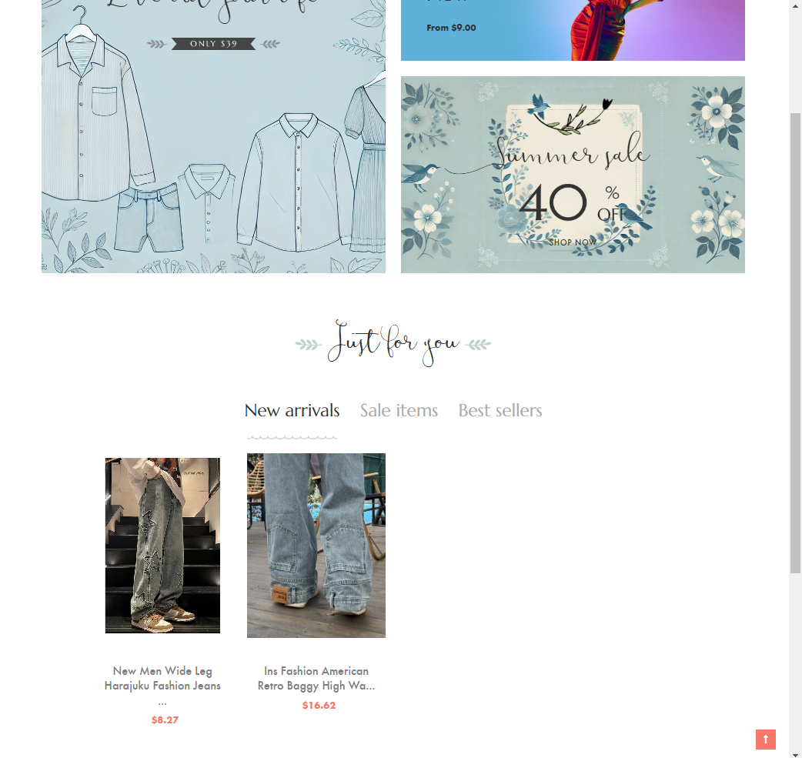
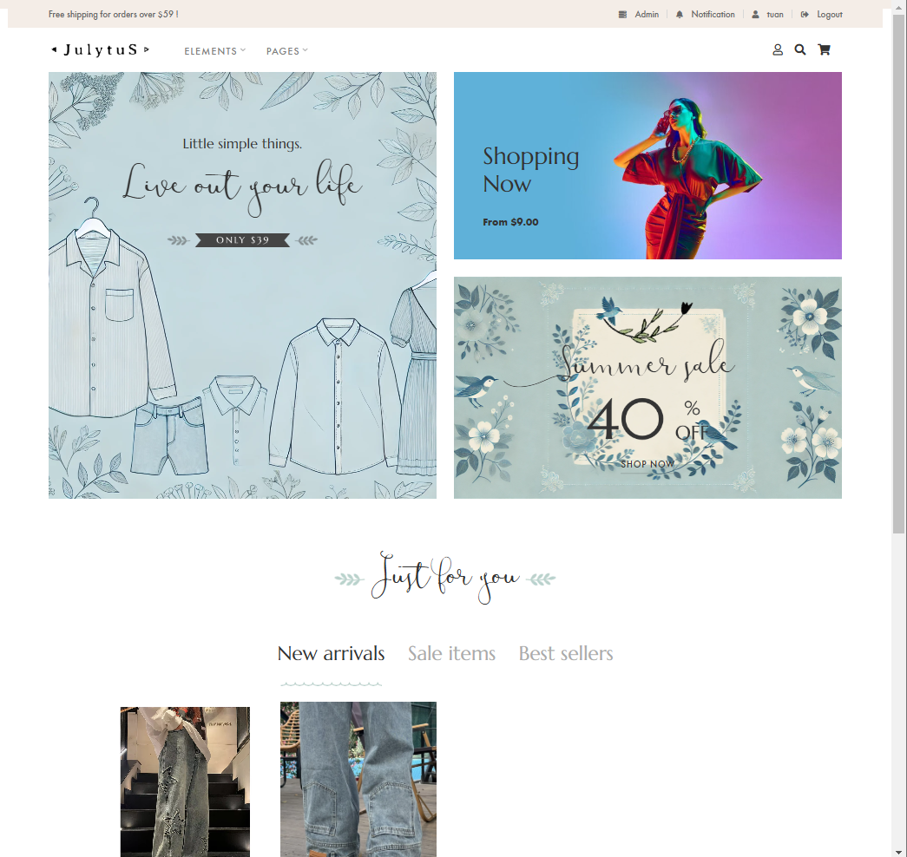

## Tentative technologies and frameworks

- Java 21
- Spring boot 3.4
- React 18.3.1
- Kafka
- Elasticsearch
- Redis


## Main Features
- Identity – User authentication & authorization
- Search – Basic search using Elasticsearch
- Kafka – Synchronizing Product data between the main database and Elasticsearch
- Redis – Managing token blacklist for secure session management
- Cart Management – Implementing and optimizing the shopping cart functionality on the frontend

## Getting started with Docker Compose
1. Get the latest source code
2. Add the following records to your host file:
```
127.0.0.1 api.julytus.local
127.0.0.1 julytus
```
3. Open terminal of your choice, go to `dropshop` directory, run `docker compose up`, wait for all the containers up and running
4. Open your browser, now you can access the websites via `http://julytus/`;

## Expected Plan
Search Update – Enhancing the search functionality for the frontend (Planned)


## Screenshots

<table>
    <thead>
        <tr>
            <th></th>    
            <th></th>
        </tr>
    </thead>
    <tbody>
        <tr valign="top">
            <td>
                
                
                
            </td>
            <td>
                
                
                
            </td>
        </tr>
    </tbody>
</table>